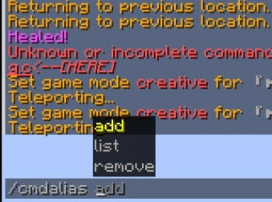

# CmdAlias

A lightweight Paper plugin to create custom command aliases at runtime — no server restart needed.
Plugin Paper ringan buat bikin alias command custom secara *runtime* — gak perlu restart server.

---

## ✨ Features / Fitur

- **`/cmdalias add <alias> <target...>`** — Create a new alias (e.g. `/tp` → `/teleport`). Re-adding an existing alias overwrites it.
  Bikin alias baru (misal `/tp` → `/teleport`). Kalau alias-nya udah ada, otomatis ditimpa.
- **`/cmdalias remove <alias>`** — Remove an existing alias.
  Hapus alias yang udah dibuat.
- **`/cmdalias list`** — List all active aliases and their targets.
  Nampilin semua alias aktif beserta target command-nya.
- **Dynamic runtime registration** — Aliases are registered as real Bukkit commands via CommandAPI, supporting extra arguments (e.g. `/tp Steve` → `/teleport Steve`).
  Alias didaftarin sebagai command Bukkit beneran lewat CommandAPI, mendukung argumen tambahan.
- **Persistent storage** — All aliases are saved to `aliases.yml` and reloaded automatically on startup.
  Semua alias tersimpan ke `aliases.yml` dan otomatis dimuat ulang saat server nyala.
- **Live tab-complete refresh** — Online players get their command list refreshed instantly after any change.
  Player online langsung dapet update tab-complete tanpa perlu reconnect.

---

## 📋 Requirements / Kebutuhan

| Component | Version |
|---|---|
| Paper | 1.21.11+ |
| Java | 21+ |
| [CommandAPI](https://modrinth.com/plugin/commandapi) (Paper plugin) | 11.2.0+ |

> ⚠️ CommandAPI must be installed as a **separate plugin** on your server — it is not shaded into this jar.
> ⚠️ CommandAPI harus terinstall sebagai **plugin terpisah** di server — gak di-*shade* ke dalam jar ini.

---

## 🔧 Installation / Instalasi

1. Download and install [CommandAPI (Paper version)](https://modrinth.com/plugin/commandapi) into your `plugins/` folder.
   Download dan install [CommandAPI (versi Paper)](https://modrinth.com/plugin/commandapi) ke folder `plugins/`.
2. Download the latest `cmdalias.jar` from [Releases](../../releases) and drop it into `plugins/` as well.
   Download `cmdalias.jar` terbaru dari [Releases](../../releases) dan taruh juga di `plugins/`.
3. Restart your server.
   Restart server-nya.
4. Grant the `cmdalias.admin` permission (default: `op`) to whoever should manage aliases.
   Kasih permission `cmdalias.admin` (default: `op`) ke yang bakal ngatur alias.

---

## 🛠️ Building from source / Build dari source

This project uses **Maven**. It was originally developed and built on **Android via Termux**, but any Maven + JDK 21 setup works the same.
Project ini pakai **Maven**. Awalnya dikembangkan dan di-build di Android lewat **Termux**, tapi setup Maven + JDK 21 apa pun juga jalan sama aja.

### Termux (Android)

```bash
# Install prerequisites / install kebutuhan
pkg install openjdk-21 maven -y

# Clone the repo / clone repo-nya
git clone https://github.com/azizmc/Azizmc-Cmdalias-Plugin.git
cd Azizmc-Cmdalias-Plugin

# Build
mvn clean package
```

### Desktop / Linux / macOS / Windows

```bash
git clone https://github.com/azizmc/Azizmc-Cmdalias-Plugin.git
cd Azizmc-Cmdalias-Plugin
mvn clean package
```

The compiled jar will be at `target/cmdalias.jar`.
Jar hasil build ada di `target/cmdalias.jar`.

---

## 🔐 Permissions / Izin

| Permission | Default | Description |
|---|---|---|
| `cmdalias.admin` | `op` | Access to add/remove/list command aliases — Akses buat nambah/hapus/lihat alias command |

---

## 📄 Example / Contoh

```
/cmdalias add tp teleport
/tp Steve
→ runs /teleport Steve

/cmdalias list
→ /tp -> /teleport

/cmdalias remove tp
```

---

## 📸 Screenshots / Screenshot



*Live tab-completion showing `/cmdalias` commands in action*

---

## 📜 License / Lisensi

Feel free to add your preferred license here (MIT recommended for small utility plugins).
Silakan tambahin lisensi pilihan lu di sini (MIT direkomendasiin buat plugin utilitas kecil kayak gini).

---

Made for [GlitchMC](https://glitchmc.my.id) 🎮
